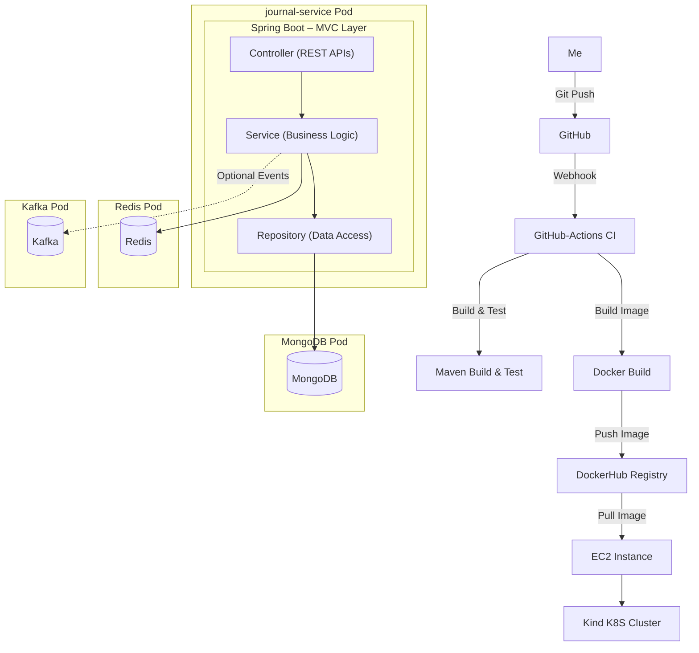
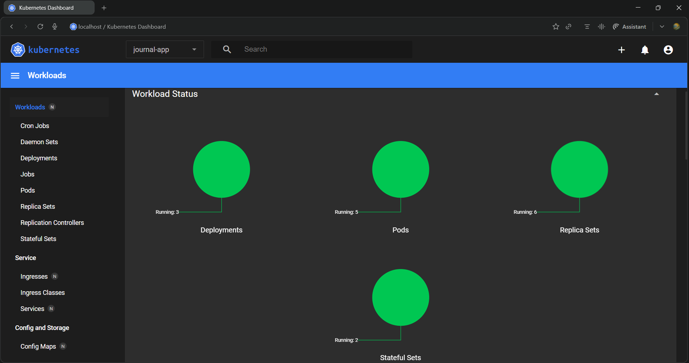
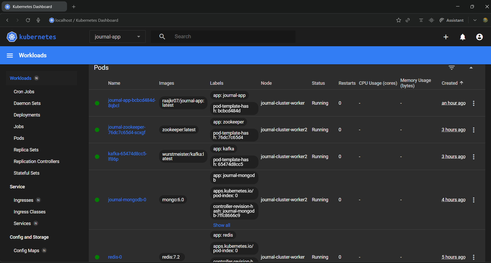
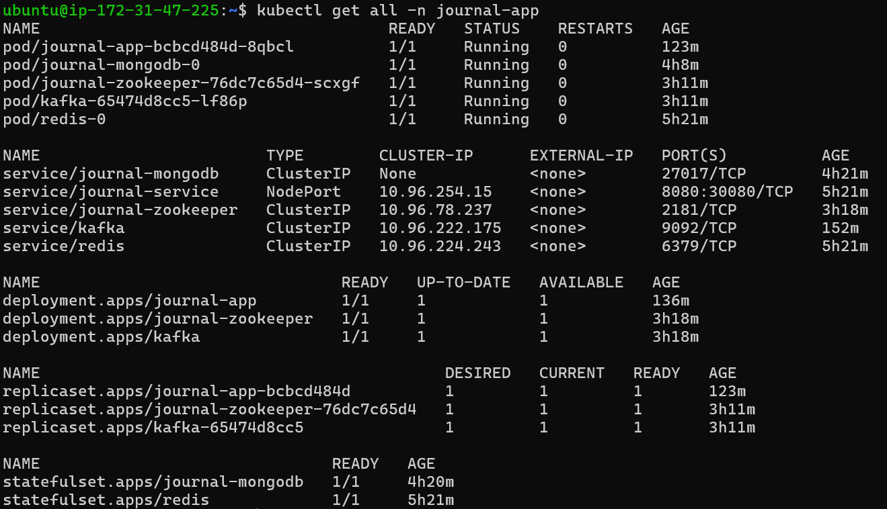

# 📝 Journal Management System

<div align="center">


**A cloud-native, containerized Journal Management platform built with Spring Boot**

Designed to serve seamlessly on **Kubernetes**, and **AWS (EC2/EKS)** with automated CI using **GitHub Actions**

[Features](#-key-features) • [Architecture](#-architecture)

</div>

---

## 🌟 Key Features

- 📝 **RESTful API:** Secure, fast, and scalable CRUD operations for journal entries  
- ⚡ **Redis Cache:** Improves response times and reduces database load for frequently accessed data  
- 💾 **MongoDB:** Flexible and reliable storage for journal data with high availability  
- 🎵 **Kafka:** Enables asynchronous event streaming
- 🐳 **Containerized:** Consistent environment across development, staging, and production
- ☸️ **Kubernetes:** Production-ready manifests with ConfigMaps, Secrets, and pod orchestration  
- ☁️ **AWS Ready:** Deployable on EC2 with Kind(k8s cluster provider) integration for container images  
- 🔄 **CI Automation:** GitHub Actions automate build, test, image creation, push to repository

---

```
## 📡 API & Documentation

Application API is fully documented with Swagger. Once everything run on my machine 😉:
- **API Documentation**: http://localhost:8080/swagger-ui.html
- **Health Check**: http://localhost:8080/actuator/health

Note: the K8S, all yaml manifiest files are in another branch(kubernetes) of this repo, obviously
```
## 📋 Table of Contents

- [Overview](#-overview)
- [Architecture](#-architecture)
- [Dashboard](#-K8S-Dashboard)
- [Application Flow](#-application-flow)
- [Local Development](#-local-development)
- [Docker & Containerization](#-docker--containerization)
- [Future Enhancements](#-future-enhancements)

---

## 🚀 Overview

The **Journal Management System** is a production-grade backend service that exposes REST APIs to manage journal entries in a secure and scalable way.

Built using **Spring Boot** and following **cloud-native**, the same artifact runs consistently across:
- 💻 Local development environment
- 🐳 Docker containers
- ☸️ Kubernetes clusters (Kind, K3s)
- ☁️ AWS infrastructure (EC2, EKS)

This project showcases **DevOps + Backend Engineering** expertise through:
- Container orchestration with Kubernetes
- Infrastructure as Code with K8s manifests
- Automated CI pipelines with GitHub Actions
- Multi-environment deployment strategies
- Cloud-native architecture patterns

> **Note:** If the chart fails to load:
> - Copy the code
> - Open the link  
>   👉 https://mermaid.live/edit
> - Paste it into the editor

## 🏗 Architecture

```
Left side: running pods and all databases
Right side: Entire flow of journal-app, from devlopment to deploying
```



### Detailed Flow

1. **Development** - Built the application
1. **push** - push code to GitHub repository
2. **CI Trigger** - GitHub Actions workflow starts automatically on push/PR
3. **Build** - Maven compiles Java code and runs unit/integration tests
4. **Containerize** - Docker builds the application image from Dockerfile
5. **Publish** - Image pushed to container registry (DockerHub)
6. **Deploy** - pulls image and deploys using manifests in any k8S provider
7. **Configure** - ConfigMaps and Secrets injected into containers
8. **Expose** - Application accessible via Kubernetes Service and Ingress
---

## 🌟 K8S Dashboard

|  | Image | Description |
|---------|------|-------------|
| All Service |  | Here we can see all the implemented Service, Deployment, Replicaset|
| Pods |  | All the running Pods |
| EC2 |  | All running services, pods, replicaset |

## 🚧 Future Enhancements

### Planned Features

- **Helm Charts** - Package Kubernetes resources for easier deployment
- **GitOps with ArgoCD** - Declarative continuous delivery
- **Observability Stack**
    - Prometheus for metrics collection
    - Grafana for visualization
    - Loki for log aggregation
    - Jaeger for distributed tracing
- **API Gateway** - Nginx/Traefik/Spring Cloud Gateway for unified routing
- **Auto-scaling**
    - Horizontal Pod Autoscaler (HPA)
    - Vertical Pod Autoscaler (VPA)
    - Cluster Autoscaler
- **Event-Driven Features**
    - Kafka integration for notifications
    - Audit logging
    - Async workflows
- **Database Enhancements**
    - MongoDB replica sets
    - Automated backups
    - Read replicas
- **Security Hardening**
    - Vault integration for secrets
    - Network policies
    - Pod security policies
- **Multi-Region Deployment**
    - Global load balancing
    - Disaster recovery

## 👨‍💻 About Me

I'm a full-stack developer with a strong interest in building and deploying applications that integrate real-time functionality. This project began as an experiment to explore, but it gradually evolved into a product I am genuinely proud of.

Along the way, I began learning DevOps. both to support the project and, realistically, to remain useful in an era increasingly powered by AI.

- **LinkedIn**: www.linkedin.com/in/raajkumar07
- **Email**: rajkumar07.dev@example.com
- **Portfolio**: raajkumar.in

## 🙏 Acknowledgments

This project wouldn't have been possible without:

- The **Spring Boot team** - for making Java development actually enjoyable
- The **React community** - for an amazing frontend framework
- **MongoDB** && **Redis** && **Kafka** teams - for rock-solid Products
- All the **open-source contributors** whose libraries made this possible